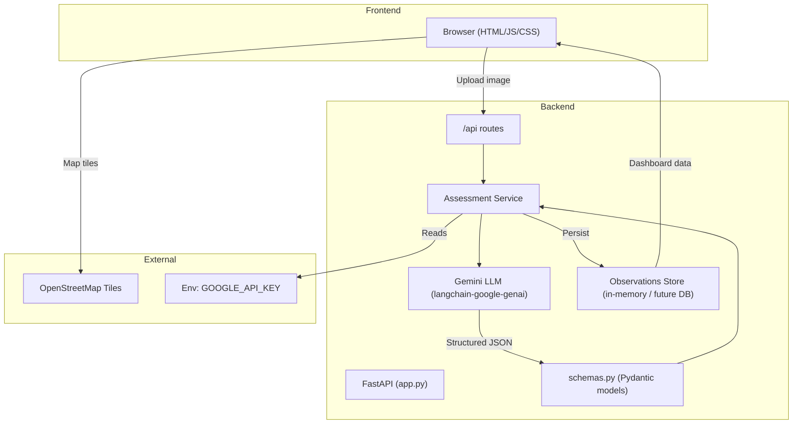

## 📘 AquaSafe AI – Professional README  

---  

### Table of Contents  
1. [Project Overview](#overview)  
2. [Key Features](#features)  
3. [Architecture & Data Flow](#architecture)  
4. [Tech Stack](#tech-stack)  
5. [Installation & Deployment](#installation)  
6. [Running Locally](#local-run)  
7. [API Reference](#api)  
8. [License & Contributing](#license)  

---  

<a id="overview"></a>  

## 🚀 Overview  

**AquaSafe AI** is a production‑ready web application that leverages **Google Gemini** (via the `langchain‑google‑genai` wrapper) to provide **visual, evidence‑based water‑body risk assessments**.  

- The system analyses a single user‑uploaded image of a water body.  
- Gemini generates a **structured 12‑field response** (risk level, confidence scores, visible evidence, one‑health insights, etc.).  
- Citizens can **validate** the AI’s output; any mismatch triggers a human‑review workflow.  
- All assessments are plotted on an **open‑source OpenStreetMap** dashboard for community monitoring.  

> **Important:** The model only evaluates *visible* environmental risk. It **never** claims to determine potability or laboratory‑grade safety.  

---  

<a id="features"></a>  

## ✨ Key Features  

| ✅ | Feature | Description |
|---|---------|-------------|
| **🖼️ Image‑to‑Insight** | Upload a single snapshot, receive a structured risk report. |
| **🧭 OpenStreetMap Dashboard** | Community‑wide view of all observations with clustering & pop‑ups. |
| **👥 Citizen vs. AI Validation** | Users can mark AI predictions as correct/incorrect; mismatches open a reviewer modal. |
| **🧩 One‑Health Insights** | Provides ecosystem, aquatic‑life, and human‑well‑being context. |
| **🔐 Secure Secrets** | `GOOGLE_API_KEY` is injected via environment variable (Railway or local `.env`). |
| **⚙️ Cloud‑Native Deploy** | Ready‑to‑run on Railway (or any Docker‑compatible host) using `$PORT`. |
| **📊 Community Data** | Persistent in‑memory store of observations (extendable to a DB). |
| **🛠️ Extensible Architecture** | Clean separation: FastAPI router → service layer → LLM wrapper → data models. |

---  

<a id="architecture"></a>  

## 🏗️ Architecture & Data Flow  



**Explanation**  

1. **User Interaction** – The browser sends a multipart/form‑data request (`/api/assess`).  
2. **FastAPI Router** – Validates the payload, forwards the image bytes to the *Assessment Service*.  
3. **Assessment Service** – Constructs a Gemini prompt (see `prompt.py`), calls the LLM via the LangChain wrapper, and parses the response into the `WaterAssessment` Pydantic model (`schemas.py`).  
4. **Persistence** – The structured result is saved in the in‑memory `observations` list (future‑proofed for a relational DB).  
5. **Community Dashboard** – The `/api/observations` endpoint streams all stored records; the front‑end renders them on a Leaflet map using free OSM tiles.  
6. **Citizen Validation** – Users can flag mismatches; the UI opens a modal that records a human reviewer’s note.  

---  

<a id="tech-stack"></a>  

## 🛠️ Tech Stack  

| Layer | Technology | Reason |
|-------|------------|--------|
| **Web Framework** | **FastAPI** (Python 3.13) | High‑performance async API, automatic OpenAPI docs. |
| **LLM Integration** | `langchain‑google‑genai` | Clean wrapper around Gemini, prompt management. |
| **Data Validation** | **Pydantic** (BaseModel) | Guarantees strict JSON schema. |
| **Frontend** | HTML 5 + Vanilla CSS + **Leaflet.js** | No heavy framework – lightweight, responsive UI. |
| **Map Tiles** | **OpenStreetMap** | Free, no API‑key restrictions. |
| **Deployment** | **Railway** (Docker + Railpack) | One‑click deployment, dynamic `$PORT`. |
| **Containerisation** | Python virtual env (`.venv`) + `uvicorn` | Guarantees reproducible runtime. |
| **Version Control** | Git + GitHub | Collaboration & CI/CD. |

---  

<a id="installation"></a>  

## 📦 Installation & Deployment  

### 1️⃣ Prerequisites  

- **Python 3.13+** (recommended via `pyenv` or the Railway‑provided runtime).  
- **Google Gemini API key** – create at <https://aistudio.google.com/app/apikey>.  

### 2️⃣ Local Setup  

```bash
# clone the repo
git clone https://github.com/AffanZulfiqar/AquaSafe.git
cd AquaSafe

# create a virtual environment
python -m venv .venv
# activate (Windows)
.\.venv\Scripts\activate

# install dependencies
pip install -r requirements.txt

# create .env file
echo GOOGLE_API_KEY=YOUR_GEMINI_KEY > .env

# start the server
.\.venv\Scripts\python -m uvicorn app:app --host 0.0.0.0 --port 8000
```

Visit <http://localhost:8000> – you should see the landing page.

### 3️⃣ Deploy to Railway (one‑click)  

1. **Create a new project** → link the GitHub repo `AffanZulfiqar/AquaSafe`.  
2. Railway auto‑detects the `railpack-plan.json` and installs the Python venv.  
3. Set **environment variable** `GOOGLE_API_KEY` in *Settings → Environment*.  
4. Set the **Start Command** to  

```bash
/app/.venv/bin/python -m uvicorn app:app --host 0.0.0.0 --port $PORT
```  

5. Click **Deploy** – Railway will provision a public domain.

---  

<a id="local-run"></a>  

## 🖥️ Running Locally (Docker option)  

```bash
docker build -t aquasafe .
docker run -e GOOGLE_API_KEY=$GOOGLE_API_KEY -p 8000:8000 aquasafe
```  

---  

<a id="api"></a>  

## 📡 API Reference (selected endpoints)

| Method | Path | Description | Example Response |
|--------|------|-------------|------------------|
| `POST` | `/api/assess` | Upload image → Gemini risk report. | `{ "risk_level":"MODERATE", "visually_safe":68.2, ... }` |
| `GET` | `/api/observations` | List all community observations (GeoJSON). | `[{ "id":1, "lat":12.34, "lon":56.78, "risk_level":"HIGH", ...}]` |
| `POST` | `/api/observations/{id}/review` | Submit human reviewer note for a mismatch. | `{ "status":"reviewed", "reviewer_note":"..."} ` |
| `GET` | `/api/status` | Health‑check (returns `{"status":"ok"}`). | N/A |

Full OpenAPI docs available at <http://localhost:8000/docs> after the server starts.  

---  

<a id="license"></a>  

## 📄 License & Contributing  

- **License:** MIT – feel free to reuse, remix, and commercialise.  
- **Contributing:** Fork → create a feature branch → open a PR. Please keep the **Pydantic schema** in sync with any new fields and update `prompt.py` accordingly.  
